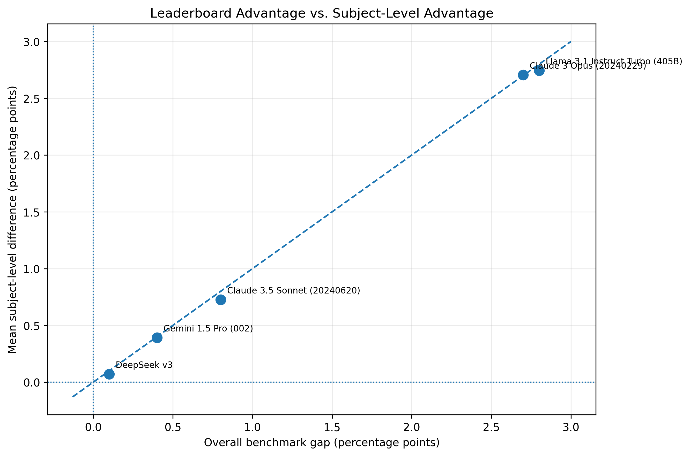
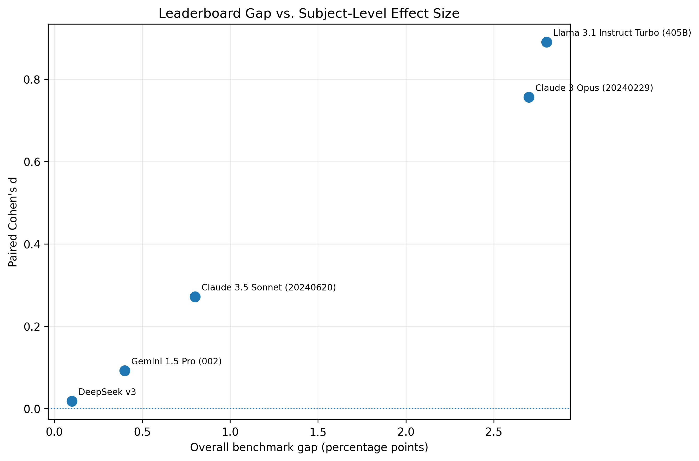
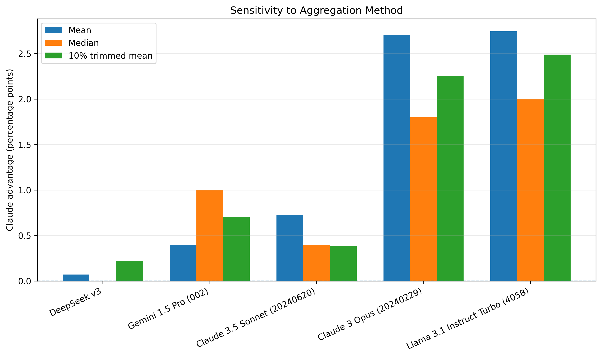
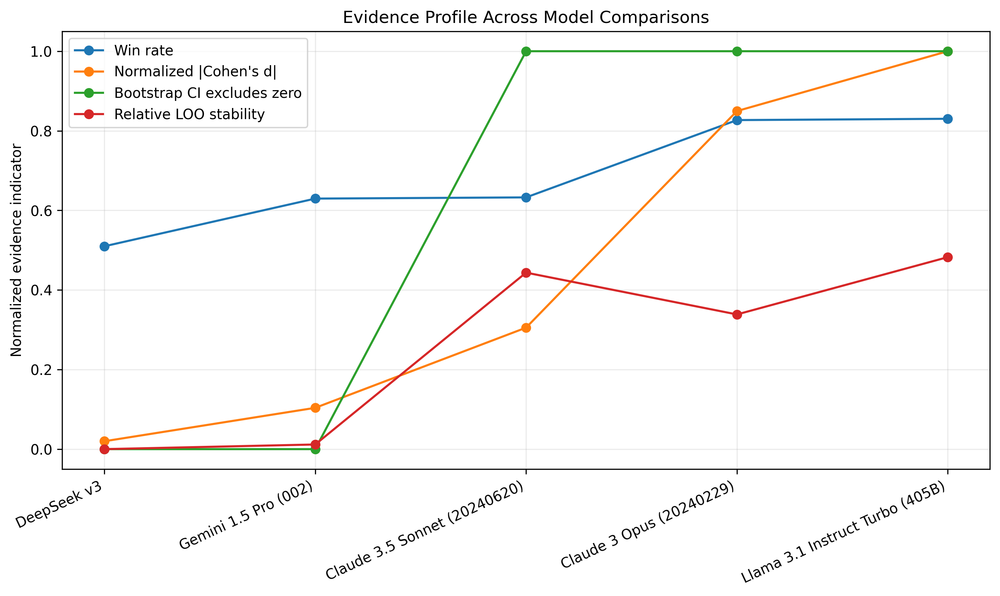
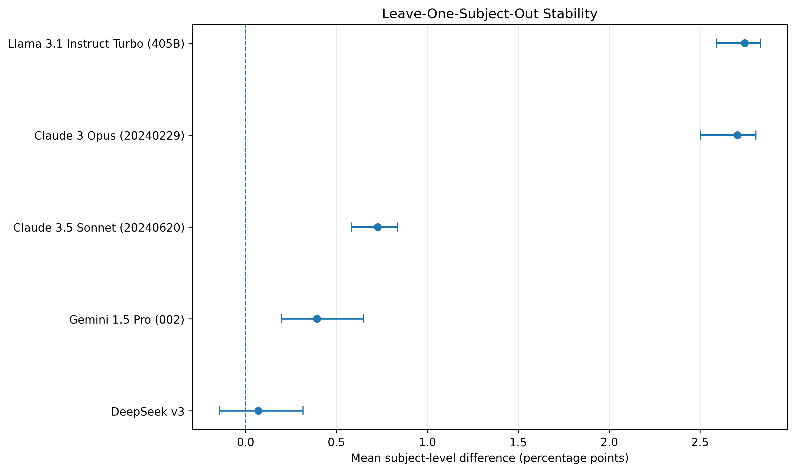
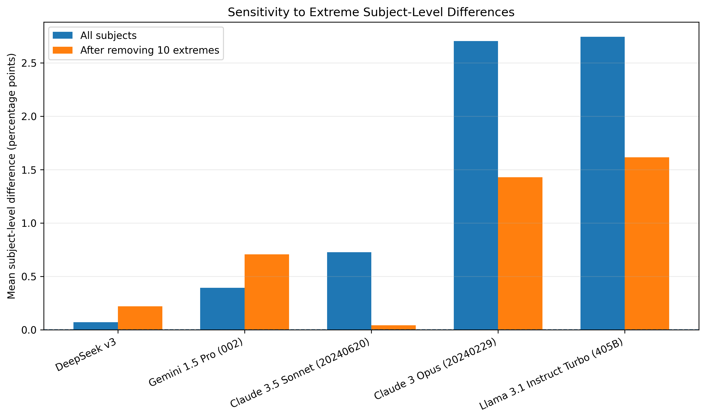
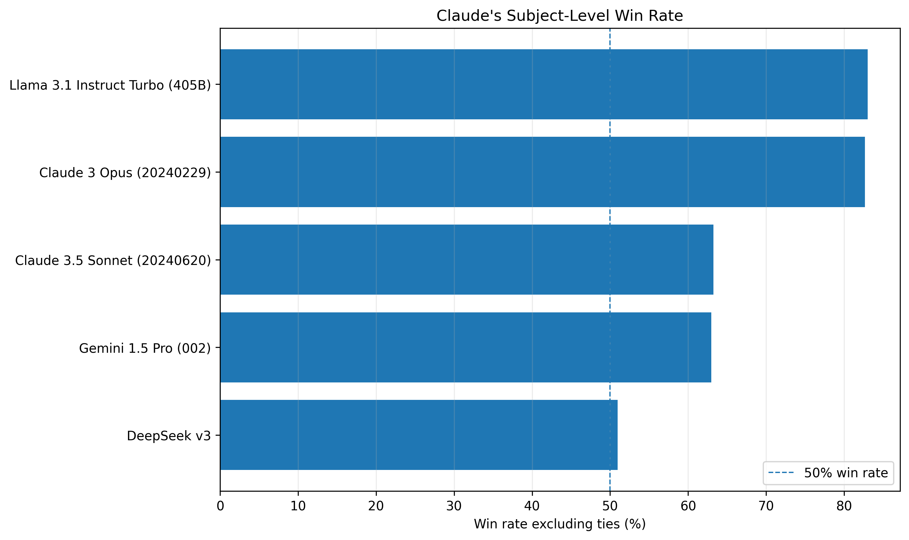
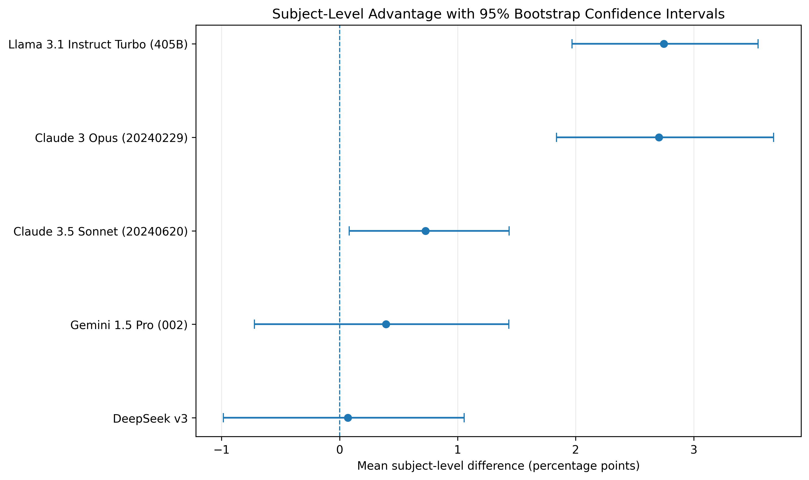

# Benchmark Claim Auditor

### When does a higher benchmark score actually provide strong evidence?

Benchmark leaderboards often reduce model performance to a single aggregate score.

A model scoring **87.3%** while another scores **87.2%** is ranked higher—but does that 0.1 percentage-point difference provide strong evidence that the first model is broadly better?

This project develops a **benchmark claim auditing workflow** that goes beyond headline scores by examining:

* task-level consistency
* effect size
* statistical uncertainty
* aggregation sensitivity
* leave-one-task-out stability
* sensitivity to extreme task-level differences

The goal is not to produce another leaderboard, but to ask:

> **Is the evidence actually strong enough to support the claim suggested by the leaderboard?**

---

## Research Question

A benchmark aggregate can hide substantial variation across its underlying tasks.

For two models \(A\) and \(B\), this project evaluates the task-level differences:

$$
d_i = score(A,i) - score(B,i)
$$

and asks whether the observed advantage is:

**Large enough?**
**Consistent enough?**
**Statistically supported?**
**Stable under perturbation?**
**Robust to the aggregation rule?**

This reframes benchmark comparison as an **evidence assessment problem**, rather than simply a ranking problem.

---

# Case Study: HELM MMLU

The primary experiment uses the HELM MMLU reference data containing:

* **79 models**
* **57 subjects**
* 1 overall MMLU score
* 1 score for each subject

The highest-scoring model in the reference data is:

**Claude 3.5 Sonnet (20241022) — 87.3%**

It is compared against the next five models in the ranking.

| Model                           | Overall Score | Gap vs Claude |
| ------------------------------- | ------------: | ------------: |
| Claude 3.5 Sonnet (20241022)    |     **87.3%** |             — |
| DeepSeek v3                     |         87.2% |       +0.1 pp |
| Gemini 1.5 Pro (002)            |         86.9% |       +0.4 pp |
| Claude 3.5 Sonnet (20240620)    |         86.5% |       +0.8 pp |
| Claude 3 Opus (20240229)        |         84.6% |       +2.7 pp |
| Llama 3.1 Instruct Turbo (405B) |         84.5% |       +2.8 pp |

---

# Key Findings

## 1. A 0.1-point leaderboard advantage provides weak evidence

Claude 3.5 Sonnet (20241022) scores **87.3%**, compared with **87.2%** for DeepSeek v3.

The leaderboard gap is therefore only:

### **+0.1 percentage points**

But examining the 57 underlying subjects tells a different story.

| Diagnostic                |                  Claude vs DeepSeek |
| ------------------------- | ----------------------------------: |
| Overall gap               |                        **+0.10 pp** |
| Mean subject difference   |                       **+0.070 pp** |
| Median subject difference |                        **0.000 pp** |
| Wins                      |                              **26** |
| Ties                      |                               **6** |
| Losses                    |                              **25** |
| Win rate                  |                           **51.0%** |
| Paired Cohen's d          |                           **0.018** |
| Wilcoxon p-value          |                           **0.683** |
| 95% bootstrap CI          | **approximately −0.98 to +1.06 pp** |

The result is therefore highly uncertain at the subject level.

This does **not** prove that the two models are equally capable.

Rather, it shows that:

> **The 0.1-point leaderboard advantage provides weak evidence of broad subject-level superiority.**



---

## 2. Larger leaderboard gaps are accompanied by stronger evidence

The five comparisons show a useful progression:

| Comparison                   | Overall Gap | Mean Difference | Cohen's d | Win Rate | Evidence           |
| ---------------------------- | ----------: | --------------: | --------: | -------: | ------------------ |
| DeepSeek v3                  |     +0.1 pp |       +0.070 pp |     0.018 |    51.0% | **Weak / fragile** |
| Gemini 1.5 Pro               |     +0.4 pp |       +0.393 pp |     0.092 |    63.0% | **Weak / fragile** |
| Claude 3.5 Sonnet (20240620) |     +0.8 pp |       +0.726 pp |     0.272 |    63.3% | **Moderate**       |
| Claude 3 Opus                |     +2.7 pp |       +2.705 pp |     0.756 |    82.7% | **Strong**         |
| Llama 3.1 405B               |     +2.8 pp |       +2.746 pp |     0.890 |    83.0% | **Strong**         |

The important result is **not a universal threshold**.

Instead, the evidence becomes more convincing when a leaderboard advantage is accompanied by:

* consistent task-level wins
* meaningful effect size
* uncertainty that excludes zero
* stability under perturbation
* agreement across aggregation methods



---

## 3. Aggregation method can change the conclusion

For Claude vs DeepSeek:

| Aggregation      |    Difference |
| ---------------- | ------------: |
| Mean             | **+0.070 pp** |
| Median           |  **0.000 pp** |
| 10% trimmed mean | **+0.219 pp** |

The mean suggests a small Claude advantage.

The median produces a **tie**.

The trimmed mean restores a positive advantage.



This demonstrates that a single aggregate statistic can hide important information about the distribution of task-level outcomes.

For the larger model gaps, conclusions are substantially less sensitive to the aggregation rule.

---

## 4. Individual leaderboard positions can be sensitive even when the overall ranking is stable

Across all 79 MMLU models, rankings produced using the mean, median, and 10% trimmed mean are highly correlated:

| Comparison                 | Spearman ρ |
| -------------------------- | ---------: |
| Mean vs Median             |  **0.986** |
| Mean vs 10% Trimmed Mean   |  **0.999** |
| Median vs 10% Trimmed Mean |  **0.990** |

The overall leaderboard therefore remains broadly similar.

However, individual models can move considerably in rank.

The practical lesson is:

> **High rank correlation does not imply that every individual model's position is equally robust.**



---

## 5. Leave-one-subject-out analysis exposes stability

The auditor removes each MMLU subject once and recomputes the mean difference.

For Claude vs DeepSeek:

* minimum leave-one-out mean: **−0.143 pp**
* maximum: **+0.316 pp**
* range: **0.459 pp**
* Claude remains ahead in **50 / 57** analyses
* DeepSeek leads in **6 / 57**
* **1 tie**



The headline difference is only **+0.1 pp**, so individual subjects can materially affect the aggregate.

At the same time, Claude remains ahead in most leave-one-out analyses.

This is more informative than simply saying that one model occupies the top position on the leaderboard.

---

## 6. Extreme task-level differences influence the aggregate

The auditor also removes the most extreme absolute subject-level differences.

For Claude vs DeepSeek:

| Analysis                        | Mean Difference |
| ------------------------------- | --------------: |
| All subjects                    |   **+0.070 pp** |
| Remove 10 most extreme subjects |   **+0.219 pp** |



The extreme subjects contain large differences **in both directions**.

Therefore, the correct interpretation is not that outliers simply "created" Claude's advantage.

Instead:

> **The aggregate mean is sensitive to extreme task-level differences, which can materially change the reported average.**

This is why outlier sensitivity is useful when auditing benchmark claims.

---

# Methodology

For each pair of models, the auditor constructs paired task-level differences:

$$
d_i = score(A,i) - score(B,i)
$$

It then evaluates five dimensions of evidence.

### 1. Magnitude

**Mean difference**
Average task-level advantage.

**Median difference**
Typical task-level advantage under median aggregation.

**10% trimmed mean**
Mean after removing the most extreme 10% of task-level differences.

**Paired Cohen's d**
Standardized effect size for the paired differences.

---

### 2. Consistency

The auditor counts:

* wins
* ties
* losses

and calculates:

$$
Win\ Rate = \frac{wins}{wins + losses}
$$

Ties are excluded from the denominator.



---

### 3. Statistical Evidence

**Wilcoxon signed-rank test**

A paired non-parametric test is applied to non-zero task-level differences.

**Bootstrap confidence interval**

The task-level differences are resampled **10,000 times** to estimate uncertainty around the mean difference.

The bootstrap reports:

* 95% confidence interval
* proportion of bootstrap samples with a positive mean difference



---

### 4. Stability

**Leave-one-subject-out analysis**

Each subject is removed once and the mean difference is recomputed.

This produces:

* minimum mean difference
* maximum mean difference
* range
* number of analyses favoring each model

---

### 5. Sensitivity to Extreme Tasks

The auditor removes the:

* 1 most extreme subject
* 3 most extreme subjects
* 5 most extreme subjects
* 10 most extreme subjects

based on absolute task-level difference.

This reveals whether the aggregate result is highly sensitive to extreme outcomes.

---

### 6. Aggregation Sensitivity

The comparison is evaluated using:

* mean
* median
* 10% trimmed mean

This tests whether a conclusion depends heavily on the chosen aggregation rule.

---

# Evidence Classification

The auditor provides an interpretable evidence profile:

* **Strong evidence**
* **Moderate evidence**
* **Weak / fragile evidence**
* **No clear superiority**

These labels are a **practical evidence heuristic**, not universal statistical thresholds.

The underlying statistics are always reported separately.

The evidence profile is intended to help interpret multiple diagnostics together—not to replace them with a single score.


---

# Connection to Existing Research

This project is inspired by the 2026 position paper:

> **State-of-the-Art Claims Require State-of-the-Art Evidence**

by YongKyung Oh.

The work argues that marginal improvements in aggregate benchmark scores can provide weak evidence of genuine superiority and emphasizes properties including:

1. **Magnitude**
2. **Consistency**
3. **Stability**

This project uses those ideas as a starting point and builds a practical auditing workflow around them.

### Reproduced vs Extended

This project does **not** claim to reproduce the entire original paper.

Instead, it uses the paper's benchmark-fragility perspective as the conceptual foundation and adds an implementation-oriented auditing layer including:

* paired statistical analysis
* bootstrap uncertainty
* aggregation sensitivity
* leave-one-subject-out analysis
* extreme-task sensitivity
* interpretable evidence profiles

The objective is a **reusable benchmark claim auditor**, not a reimplementation of the entire paper.

---

# What This Project Demonstrates

The main contribution is not a new model or benchmark.

It demonstrates a research workflow for stress-testing empirical claims:

```text
Headline score
      ↓
Task-level differences
      ↓
Magnitude
      ↓
Consistency
      ↓
Statistical uncertainty
      ↓
Aggregation sensitivity
      ↓
Stability analysis
      ↓
Extreme-task sensitivity
      ↓
Evidence profile
```

The central lesson is simple:

> **A higher benchmark score is not automatically strong evidence of superiority.**

A convincing claim should survive multiple forms of scrutiny.

---

# Reproducibility

### Environment

* Python 3.x
* NumPy
* pandas
* SciPy
* Matplotlib
* random seed: **42**
* bootstrap resamples: **10,000**

### Analysis

Reusable auditing logic:

```text
benchmark_claim_auditor.py
```

Primary experiment:

```text
notebooks/mmlu_claim_audit.ipynb
```

Numerical results:

```text
results/mmlu_claim_audit.csv
results/mmlu_claim_audit.json
```

Experiment configuration:

```text
results/reproducibility_manifest.json
```

---

# Repository Structure

```text
benchmark-claim-auditor/
│
├── README.md
├── benchmark_claim_auditor.py
│
├── data/
│   └── mmlu.csv
│
├── notebooks/
│   └── mmlu_claim_audit.ipynb
│
├── figures/
│   ├── overall_vs_subject_mean_gap.png
│   ├── mean_difference_bootstrap_ci.png
│   ├── subject_win_rate.png
│   ├── aggregation_sensitivity.png
│   ├── loo_stability.png
│   ├── outlier_sensitivity.png
│   ├── overall_gap_vs_effect_size.png
│   └── evidence_profile.png
│
└── results/
    ├── mmlu_claim_audit.csv
    ├── mmlu_claim_audit.json
    └── reproducibility_manifest.json
```

---

# Limitations

### 1. Single benchmark case study

The current empirical analysis focuses on MMLU. Results should not automatically be generalized to every benchmark.

### 2. Observational benchmark data

The analysis evaluates reported model scores rather than independently rerunning every model evaluation.

### 3. Model versions matter

Different model snapshots can differ in training data, prompting, evaluation settings, and release conditions.

### 4. Statistical significance is not practical significance

A statistically detectable difference is not necessarily important in practice.

Likewise, failure to reach statistical significance does not prove equality.

### 5. Evidence labels are heuristics

The classification system is an interpretability layer over multiple diagnostics, not a formally validated statistical decision procedure.

### 6. Task weighting is not universally determined

Equal weighting treats every MMLU subject equally. Different weighting schemes can produce different aggregate conclusions.

---

# References

**Oh, YongKyung.**
*State-of-the-Art Claims Require State-of-the-Art Evidence.*
ICML 2026, in press.

The implementation is informed by the accompanying benchmark-fragility research and its publicly available analysis framework.
